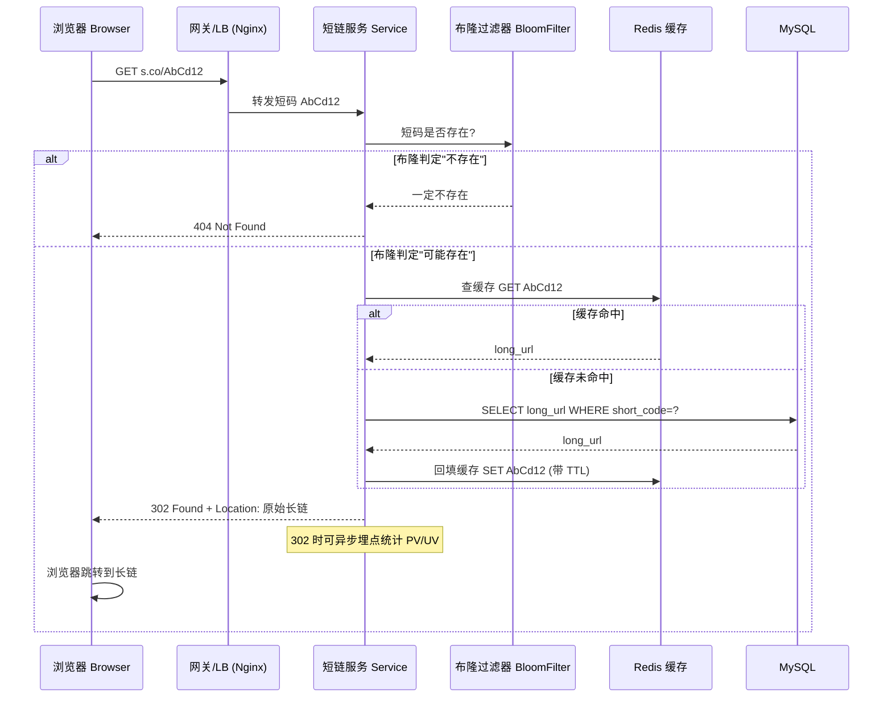

# 01 · 短链系统（Short URL）

> **一句话定位**：把长 URL 映射成一个短码（如 `t.cn/AbCd12`），访问短链时跳转回原始长链。
> 面试万金油题，考点集中在：**短码生成方案 + 读多写少的高并发缓存**。
> 答题套路：**需求澄清 → 容量估算 → 核心设计（短码生成 ★）→ 难点权衡 → 演进**。

---

## 一、需求澄清（先问清楚再动手）

**核心功能**
- **长链 → 短链**：输入 `https://www.example.com/a/very/long/path?x=1&y=2`，返回 `https://s.co/AbCd12`。
- **访问短链跳转**：用户访问短链，服务端返回 HTTP 重定向到原始长链。
- 短码尽量**短**、**不可枚举**（安全）、支持**自定义**与**过期**。

**非功能需求**
- **读多写少**：生成（写）少，访问跳转（读）多，读写比常见 **100:1 ~ 1000:1**。
- 高可用、低延迟（跳转 P99 < 100ms）。

### ⭐ 面试高频：301 vs 302 怎么选？

| 维度 | 301 Moved Permanently | 302 Found（临时重定向） |
|---|---|---|
| 语义 | 永久重定向 | 临时重定向 |
| 浏览器缓存 | **会缓存**，下次直接跳，不再请求短链服务 | **不缓存**（默认），每次都请求短链服务 |
| 服务器压力 | **小**（后续请求打不到服务器） | 大（每次都要经过服务器） |
| 能否统计 PV/UV | **不能**（被缓存后拿不到请求） | **能**，每次都经过服务端可埋点统计 |
| 适用 | 纯跳转、追求性能、不关心统计 | 需要点击统计、需要随时改跳转目标、防刷 |

> **结论**：大厂短链（如营销短链）几乎都用 **302**，因为**要统计点击数据 + 保留随时下线/改跳的控制权**；纯图省事、极致性能才用 301。面试说清楚这个 trade-off 就是加分点。

---

## 二、容量估算（Capacity Estimation）

**假设**：日增 **1 亿** 条短链（写），读写比按 **100:1** 算。

| 指标 | 估算 |
|---|---|
| 写 QPS | 1 亿 / 86400s ≈ **1160 QPS**，峰值 ×3 ≈ **3500 QPS** |
| 读 QPS | 写 ×100 ≈ **11.6 万 QPS**，峰值 ≈ **35 万 QPS**（读是重点）|
| 单条存储 | 短码 + 长链 + 元数据 ≈ **0.5 KB** |
| 日增存储 | 1 亿 × 0.5KB ≈ **50 GB/天** |
| 5 年存储 | 50GB × 365 × 5 ≈ **90 TB**（需分库分表 + 冷热分离）|

### 短码长度：62 进制够用吗？

短码字符集 = `[a-zA-Z0-9]`，共 **62** 个字符（Base62）。长度 N 的容量 = 62^N：

| 短码长度 | 容量（62^N） | 够用多久（按 1 亿/天）|
|---|---|---|
| 6 位 | 62^6 ≈ **568 亿** | ≈ 568 天（约 1.5 年）|
| **7 位** | 62^7 ≈ **3.5 万亿** | ≈ **95 年**，主流选择 ✅ |
| 8 位 | 62^8 ≈ 218 万亿 | 几乎用不完，但太长 |

> **结论**：**7 位** 是甜点，短且容量足够（3.5 万亿）。回答时能顺手算出 62^7 ≈ 3.5 万亿就很稳。

---

## 三、★ 核心：短码生成方案（重点对比）

> 这是本题的**灵魂**，面试官一定深挖。三种方案，**推荐方案 ①**。

### 方案对比总览

| 方案 | 短码长度 | 冲突 | 有序/可预测 | 评价 |
|---|---|---|---|---|
| ① **发号器 + Base62** | 短（可控） | **无冲突** | 有序、可被枚举 | ✅ **推荐**，工程首选 |
| ② 哈希（MD5 取子串） | 短 | **有冲突**需处理 | 不可预测 | 冲突处理麻烦 |
| ③ 随机生成 + 查重 | 短 | 有冲突需查重 | 不可预测 | 高水位时查重代价大 |

---

### ① 发号器 + Base62 转换（★ 推荐）

**思路**：全局**自增 ID** → 转成 **62 进制** 字符串即短码。

```
分布式发号器产出 ID: 10000000
        │
        ▼  转 62 进制（Base62 编码）
      "FXsj"   ← 短码
```

- **无冲突**：ID 全局唯一，天然不重复，省掉查重。
- **短**：自增 ID 从小到大，Base62 后位数最少。
- **ID 从哪来？** 用**分布式唯一 ID 生成器**：
  - **号段模式（Leaf-segment）**：DB 一次取一段 ID（如 1000 个）缓存到本地，用完再取，**ID 连续、性能高**，短链场景首选。
  - **雪花算法（Snowflake）**：ID 趋势递增但不连续，适合不想让号段依赖 DB 的场景。
  - 详见 → [03-distributed-id](03-distributed-id.md)

**Base62 编码核心代码（Java）**：

```java
private static final String ALPHABET =
    "0123456789abcdefghijklmnopqrstuvwxyzABCDEFGHIJKLMNOPQRSTUVWXYZ";
private static final int BASE = 62;

// 自增 ID -> 短码
public static String encode(long id) {
    StringBuilder sb = new StringBuilder();
    while (id > 0) {
        sb.append(ALPHABET.charAt((int) (id % BASE)));
        id /= BASE;
    }
    return sb.reverse().toString();
}

// 短码 -> 自增 ID（跳转时反解也可，但通常直接查表）
public static long decode(String code) {
    long id = 0;
    for (char c : code.toCharArray()) {
        id = id * BASE + ALPHABET.indexOf(c);
    }
    return id;
}
```

- **⚠️ 缺点**：ID 自增 → 短码**可被枚举/遍历**（爬业务数据）。
  **解法**：发号器 ID **乘一个大质数取模置换**、或号段内**随机跳步**、或在 ID 里**掺随机位**，打乱顺序保证不可预测。

---

### ② 哈希（MD5 取子串）

**思路**：`MD5(长链)` 得到 128 位，取其中 **前 N 位/某段** 再 Base62 → 短码。

- **优点**：同一长链哈希结果稳定，天然**幂等**（同长链得同短码，省存储）；短码**不可预测**。
- **⚠️ 核心缺点：哈希冲突**。取子串后空间变小，不同长链可能撞出同一短码。
  **冲突处理**：
  1. 生成短码后查 DB，若已存在且对应**不同**长链 → 冲突；
  2. 冲突则在长链后**加盐**（如拼接固定后缀）重新哈希，直到不冲突。
- 高水位时冲突率上升，多次查库拖慢写入。

---

### ③ 随机生成 + 查重

**思路**：直接随机生成 N 位 Base62 字符串，查 DB 是否已用，用了就重新生成。

- **优点**：实现简单，**不可预测**（安全性最好）。
- **⚠️ 缺点**：数据量越大冲突越多，**查重次数指数上升**（生日悖论），写性能不稳定。
- **优化**：查重前先过 **布隆过滤器（Bloom Filter）**，快速判断"一定不存在"，减少无谓查库。

> **一句话总结**：**发号器 + Base62 无冲突、最短、性能稳，工程首选**；只在需要"同长链复用同短码"或"极致不可预测"时才考虑哈希/随机。

---

## 四、存储设计

**映射表（短码 → 长链）**，核心一张表：

| 字段 | 说明 |
|---|---|
| `short_code` | 短码，主键/唯一索引 |
| `long_url` | 原始长链 |
| `created_at` | 创建时间 |
| `expire_at` | 过期时间（支持过期）|
| `creator_id` / `click_count` | 归属、点击统计（可选）|

**选型**：
- **MySQL**：持久化 + 分库分表（按 `short_code` 哈希分片），扛全量数据。
- **Redis 缓存**：热点短码 `short_code → long_url` 常驻，扛住 35 万 QPS 的读。
- **KV 存储**（如 HBase/RocksDB）：海量映射的另一选择，天然适合按 key 查。

**防缓存穿透 —— 布隆过滤器（Bloom Filter）**：
- 恶意/随机构造大量**不存在的短码**访问 → 每次都穿透缓存打到 DB。
- 把**所有已存在的短码**灌入布隆过滤器，查询前先问一句：
  - 布隆说"**不存在**" → 直接返回 404，**不查 DB**；
  - 布隆说"存在"（可能误判）→ 再查缓存/DB。
- 详见缓存三问题 → [../01-cheatsheet/06-redis](../01-cheatsheet/06-redis.md)

---

## 五、跳转流程（时序图）



**生成流程（写）**：`长链 → 发号器取 ID → Base62 编码得短码 → 写 DB + 布隆过滤器 + 缓存 → 返回短链`。

---

## 六、难点与权衡（面试深挖点）

| 难点 | 权衡 / 答法 |
|---|---|
| **301 vs 302** | 要统计/可控用 **302**；纯性能用 301。见第一节表格。 |
| **缓存策略** | 读多写少 → Redis 扛读，热点数据 TTL + LRU 淘汰；短链**几乎不改**，缓存命中率极高。 |
| **短码不可预测** | 发号器自增会被枚举 → **ID 置换（乘质数取模）/掺随机位**；或直接用哈希/随机方案。 |
| **防刷 / 恶意访问** | 网关**限流**（按 IP/短码），布隆过滤器挡穿透，异常访问告警。 |
| **自定义短码** | 允许用户指定（如 `s.co/mySale`）→ 单独校验唯一性，与发号器空间**隔离**（如加前缀/独立库），避免和自增短码撞车。 |
| **过期机制** | `expire_at` 字段 + Redis TTL；惰性删除（访问时判过期）+ 定时任务清理，过期短码返回 410 Gone。 |
| **短链复用** | 同一长链是否复用同短码？复用省空间但要先查（哈希方案天然复用）；多数场景**不复用**，简单优先。 |

---

## 七、高并发设计（读多写少的重点）

> 短链是**典型读多写少**系统，核心矛盾在"**读**"—— 35 万 QPS 的跳转怎么扛。

```
[浏览器] → [CDN] → [Nginx 限流/LB] → [短链服务多实例]
                                          │
                            ┌─────────────┼─────────────┐
                            ▼             ▼             ▼
                     [布隆过滤器]    [Redis 集群]   [MySQL 分库分表]
                       挡穿透        扛读(命中)      持久化(兜底)
```

- **CDN / 边缘缓存**：热点短链的 302 响应可在 CDN 边缘节点缓存（短 TTL），进一步分摊回源压力。
- **Redis 集群扛读**：短码→长链几乎不变，缓存命中率可达 99%+，是读侧主力。
- **多级缓存**：本地缓存（Caffeine）+ Redis，超热点短码本地直出。
- **服务无状态 + 水平扩展**：短链服务无状态，随读压力 HPA 自动扩缩容。
- **写侧削峰**：写量本就不大，发号器用号段模式（本地缓存 ID 段）避免每次写都访问 DB。
- 高并发全套打法详见 → [07-high-concurrency](07-high-concurrency.md)

---

## 八、演进路线（Evolution）

1. **单机版**：一张 MySQL 表 + 发号器（DB 自增 ID）+ Base62，够用即上线。
2. **加缓存**：读压力上来 → 前置 Redis，命中率拉满。
3. **防穿透**：恶意访问出现 → 加布隆过滤器 + 网关限流。
4. **分库分表**：数据量 TB 级 → 按短码分片，冷热数据分离（老数据归档）。
5. **多级 + CDN**：超大流量 → 本地缓存 + CDN 边缘缓存，服务多活容灾。
6. **数据平台**：302 埋点接入实时统计（Kafka + Flink），做点击分析/风控。

---

## 🔗 关联

- 分布式唯一 ID（发号器：号段 / 雪花）→ [03-distributed-id](03-distributed-id.md)
- 高并发系统设计 → [07-high-concurrency](07-high-concurrency.md)
- Redis 缓存穿透/击穿/雪崩 → [../01-cheatsheet/06-redis](../01-cheatsheet/06-redis.md)
- 限流细节 → [05-rate-limiter](05-rate-limiter.md)
