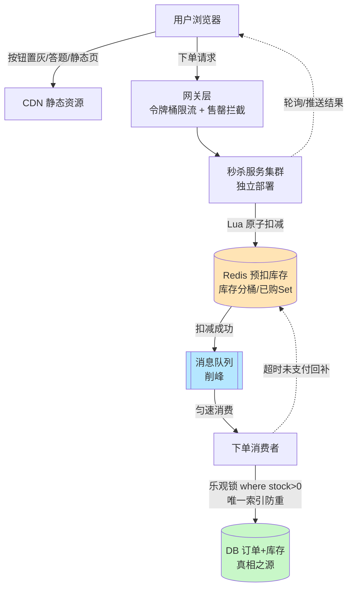
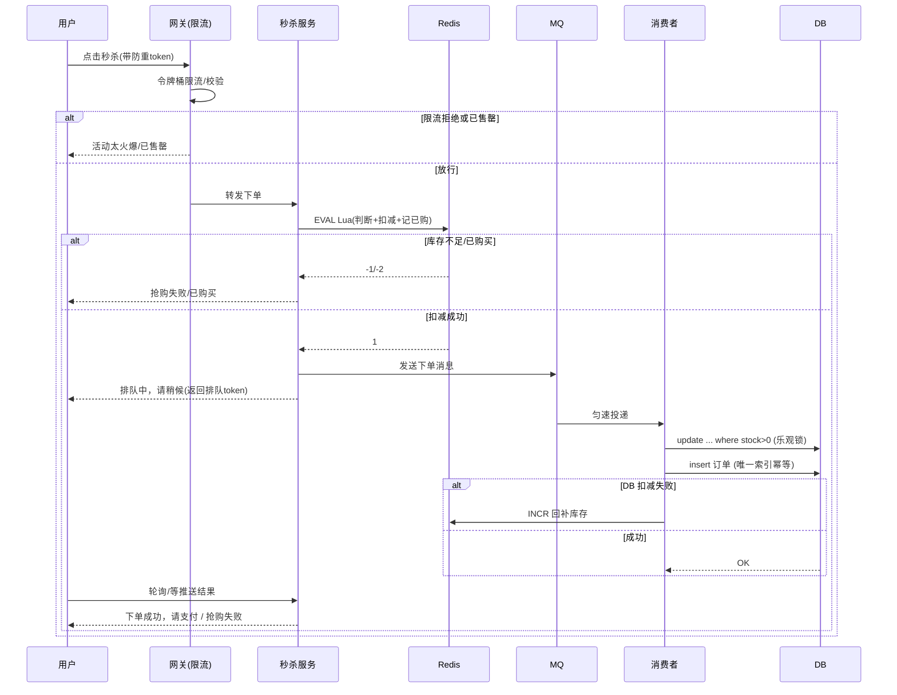

# 02 · 秒杀系统（Seckill / Flash Sale）

> **核心理念：层层削峰、层层拦截，把 99% 的请求挡在数据库之外；用 Redis 保证不超卖，用 MQ 保证不打垮。**
> 答题方法：**先说难在哪 → 分层削峰怎么拦 → 防超卖多方案 → 异步下单流程 → 一致性/防刷兜底 → 架构演进**，别一上来就堆技术点。
> 这是高频重点题，被 [06-high-availability](06-high-availability.md)、[07-high-concurrency](07-high-concurrency.md) 引用。

---

## 一、什么是秒杀？特点是什么？

**秒杀（Seckill / Flash Sale）** = 极短时间内，海量用户抢购**少量库存**商品（如整点抢 100 台手机，瞬时涌入几十万请求）。

**四大特点（决定了它难）：**

| 特点 | 说明 |
|---|---|
| **瞬时高并发** | 流量集中在开抢的几秒，峰值可达平时几百倍 |
| **读多写少** | 大量人看详情/点按钮，真正下单成功的极少 |
| **库存有限** | 100 件库存却有 50 万请求，绝大多数注定失败 |
| **短时突发** | 活动几秒~几分钟结束，不值得为它长期扩容 |

---

## 二、核心难点（先搞清"难在哪"）

| 难点 | 说明 |
|---|---|
| **瞬时超高并发** | 峰值 QPS 极高，同步打到 DB 必然连接耗尽、拖垮全站 |
| **超卖（Oversell）** | 100 件卖出 105 件 → 直接资损，**最致命，必须 0 容忍** |
| **防刷 / 黄牛脚本** | 机器人抢购、一人多单、接口被恶意刷 |
| **热点数据** | 单个商品/单条库存记录成为热点 key、热点行，锁竞争严重 |
| **不能把 DB 打垮** | DB 是最脆弱一环，QPS 上限几千，必须把它保护在最后一层 |

> 一句话总结：**用并发扛不住的量，去抢有限的库存，还不能超卖、不能崩、不能被刷。**

---

## 三、★ 分层削峰（重点：漏斗式层层过滤）

> 思路：请求像沙漏一样自上而下，**每一层拦掉一批，到 DB 时只剩涓涓细流**。
> 记忆口诀：**前端拦人 → 网关限流 → Redis 预扣 → MQ 异步 → DB 兜底**。

```
50万请求 ──前端限流──▶ 10万 ──网关令牌桶──▶ 2万 ──Redis预扣──▶ 100（库存量） ──MQ削峰──▶ 平滑落库 ──DB乐观锁──▶ 100单
   ①               ②                  ③                       ④                  ⑤
```

### ① 前端层：拦掉无效点击（第一道，最廉价）
- **按钮置灰**：点击后立即置灰 + 加载态，防止用户狂点重复提交。
- **答题 / 滑块验证码**：开抢加一道题，既防脚本又把请求在时间上打散（削峰）。
- **CDN 静态化**：商品详情页/图片/JS/CSS 全部静态化推 CDN，动静分离，动态接口只留"下单"。
- **前端随机延迟**：客户端加 0~几百 ms 随机延迟，避免所有人同一毫秒打过来。

### ② 网关层：限流 + 恶意拦截
- **令牌桶 / 漏桶限流**（按 IP / 用户 / 接口维度），超出直接快速失败返回"活动太火爆"。
- 计数器提前判断：**库存早已售罄就直接拒绝**，不放进后端。
- 限流细节与算法 → [05-rate-limiter](05-rate-limiter.md)

```nginx
# 网关粗粒度限流示例（Nginx）
limit_req_zone $binary_remote_addr zone=seckill:10m rate=5r/s;
```

### ③ ★ Redis 预扣库存（核心中的核心，挡住绝大多数请求）
- 活动开始前把库存**预热到 Redis**（`SET seckill:stock:1001 100`）。
- 每个请求先在 Redis 里**原子扣减**，扣成功才有资格下单，扣失败（返回 <0）直接告知"已售罄"。
- Redis 单机 10 万级 QPS，能把海量请求挡在内存层，**DB 完全不感知落选的请求**。
- 用 **Lua 脚本**把"判断库存 + 扣减 + 记录已购用户"合成一个原子操作（见第四节）。

### ④ ★ MQ 异步下单（削峰填谷，扣成功才发消息）
- Redis 预扣成功后，**不直接写库**，而是发一条消息进 MQ（RocketMQ / Kafka / RabbitMQ）。
- 下游消费者**按 DB 能承受的速率**匀速消费、创建订单、真正扣 DB 库存。
- 这样把"瞬时尖峰"削成"平缓水流"，DB 永远在舒适区。
- 前端拿到"排队中"，通过**轮询/推送**拿最终结果（见第五节）。

### ⑤ DB 兜底：最后一道防线（乐观锁 + 唯一索引）
- 即使前面全部失守，DB 层用 **`where stock > 0` 乐观锁** 保证绝不超卖。
- **唯一索引 `(user_id, activity_id)`** 保证一人一单，重复消息也插不进第二条。
- DB 是"真相之源（source of truth）"，Redis 只是前置加速。

---

## 四、★ 防超卖（重点：多方案，面试必问）

> 超卖本质：**"查库存"和"扣库存"两步之间存在并发窗口**。解决核心 = 让判断+扣减**原子化**。

### 方案 1 · Redis 原子扣减（Lua 保证原子）★ 首选前置拦截
`DECR` 本身原子，但"判断是否 ≥0 再扣"是两步，高并发下会扣成负数。用 **Lua 脚本**把判断+扣减+记录合并：

```lua
-- KEYS[1]=库存key  KEYS[2]=已购用户set  ARGV[1]=userId
-- 返回: -1=已售罄  -2=重复下单  1=扣减成功
if redis.call('sismember', KEYS[2], ARGV[1]) == 1 then
  return -2                                    -- 已买过，限购拦截
end
local stock = tonumber(redis.call('get', KEYS[1]))
if stock == nil or stock <= 0 then
  return -1                                    -- 售罄
end
redis.call('decr', KEYS[1])                    -- 扣减
redis.call('sadd', KEYS[2], ARGV[1])           -- 记录已购
return 1
```
- **优点**：内存级、原子、天然扛并发，把绝大多数请求挡在 DB 外。
- **注意**：Redis 扣减成功≠订单成功，最终以 DB 为准；需处理 Redis 与 DB 一致性（见第六节）。

### 方案 2 · DB 乐观锁（`where stock > 0`）★ DB 层兜底首选
不加锁，靠 **update 的条件 + 影响行数** 判断成功与否：

```sql
UPDATE seckill_stock
SET    stock = stock - 1, version = version + 1
WHERE  id = 1001 AND stock > 0;     -- 关键：stock>0 由 DB 行锁保证原子
-- 影响行数 = 1 → 扣减成功；= 0 → 已售罄，回滚订单
```
- `stock > 0` 让 DB 在**行级排他锁**下完成"判断+扣减"，天然防超卖。
- **优点**：不用悲观锁、并发好、无死锁；**缺点**：失败请求空转（可配合重试）。
- 也可用 `version` 字段做 CAS，防止 ABA。

### 方案 3 · DB 悲观锁（`SELECT ... FOR UPDATE`）
```sql
BEGIN;
SELECT stock FROM seckill_stock WHERE id = 1001 FOR UPDATE;  -- 加行锁
-- 应用层判断 stock>0
UPDATE seckill_stock SET stock = stock - 1 WHERE id = 1001;
COMMIT;
```
- **优点**：逻辑直观、强一致；**缺点**：**串行化、吞吐低、锁等待/超时**，高并发下慎用，一般不作秒杀主方案。

### 方案 4 · 唯一索引防"一人多单"
```sql
-- 订单表加唯一约束
UNIQUE KEY uk_user_activity (user_id, activity_id)
```
- 同一用户重复下单/MQ 重复消息，**第二条直接违反唯一约束插入失败**，天然幂等，防重复购买。

### 四方案对比速记

| 方案 | 位置 | 原理 | 优点 | 缺点 | 定位 |
|---|---|---|---|---|---|
| Redis + Lua | 缓存层 | 判断+扣减原子 | 抗并发、挡住海量请求 | 需保证与 DB 一致 | **前置主拦截** |
| DB 乐观锁 | DB 层 | `where stock>0` | 无锁、并发好 | 失败请求空转 | **DB 兜底首选** |
| DB 悲观锁 | DB 层 | `for update` 行锁 | 强一致、直观 | 串行、吞吐低 | 低并发场景 |
| 唯一索引 | DB 层 | 唯一约束 | 天然幂等、防多单 | 只防重复不防超卖 | 防重必配 |

> 面试标准答法：**"Redis Lua 原子扣减做前置拦截 + DB `where stock>0` 乐观锁做最终兜底 + 唯一索引防一人多单"，三者组合，既扛并发又零超卖。**

---

## 五、异步下单流程（Redis 扣成功 → MQ → 落库 → 通知）

> 关键：**同步只做"抢资格"（Redis 扣减，毫秒返回），异步做"真下单"（MQ 消费落库）。**

```
用户 ──▶ ①Redis Lua 扣减
          ├─ 失败 ──▶ 立即返回"已售罄/已购买"
          └─ 成功 ──▶ ②发 MQ 消息（userId, itemId）
                        └─▶ 立即返回"排队中，请稍候"（前端拿到排队 token）
                                    │
        ③消费者匀速消费 ──▶ DB 乐观锁扣库存 + 创建订单（唯一索引幂等）
                                    │
        ④前端轮询 / WebSocket 推送 ──▶ 拿到"下单成功，请支付" 或 "抢购失败"
```

**要点：**
- **同步链路极短**：只碰 Redis，不碰 DB，响应快、抗并发。
- **MQ 削峰**：消费速率 = DB 承受力，尖峰变平流。
- **消费者幂等**：消息可能重复投递，靠**唯一索引**或**去重表**保证一条消息只成一单。
- **前端体验**：先给"排队中"兜底文案，再轮询/推送结果，避免用户干等（对应 07 篇"降级返回排队中"）。

---

## 六、数据一致性（Redis 与 DB 最终一致）

> Redis 是前置加速，DB 是真相之源，二者要**最终一致**。

| 场景 | 问题 | 解决 |
|---|---|---|
| **Redis 扣成功但 MQ/DB 失败** | Redis 少了库存，DB 没成单 → 少卖 | 消费失败**回补 Redis 库存**（`INCR`）+ 消息重试 / 死信队列告警 |
| **超时未支付** | 占着库存不付钱 → 别人买不到 | **延时消息/定时任务**：下单 N 分钟未支付 → 取消订单 + **回补 Redis 与 DB 库存** |
| **Redis 宕机 / 数据丢失** | 预扣数据丢失 | DB 乐观锁兜底不超卖；重启后按 DB 真实库存重新预热 Redis |
| **重复消费** | 一条消息消费两次 | 唯一索引 + 幂等，保证只成一单 |

**核心原则：**
- **宁可少卖，不可超卖** —— 出错时优先回补，绝不允许 DB 卖超。
- 库存最终**以 DB 为准**，Redis 与 DB 通过"回补 + 重试 + 对账"达成最终一致。
- 缓存三问题（穿透/击穿/雪崩）→ [../01-cheatsheet/06-redis](../01-cheatsheet/06-redis.md)

---

## 七、防刷 / 防作弊（防黄牛、防脚本）

| 手段 | 说明 |
|---|---|
| **限流** | 网关按 IP/用户/接口令牌桶限流，异常高频直接拦 → [05-rate-limiter](05-rate-limiter.md) |
| **验证码 / 答题** | 图形/滑块/答题验证码，挡机器人 + 削峰 |
| **限购** | 一人一单/限 N 件，Redis Set 记录已购用户 + DB 唯一索引双保险 |
| **黑名单** | 识别刷单 IP/账号/设备指纹，加黑名单直接拒绝 |
| **接口幂等** | 下单接口带**唯一 token（防重令牌）**，重复提交只生效一次 |
| **隐藏秒杀 URL** | 秒杀地址开抢前动态生成（加随机后缀/签名），防提前脚本直连 |
| **风控** | 设备指纹、行为分析识别黄牛集群 |

---

## 八、架构演进 / 优化

**演进 1 · 独立部署（服务隔离）**
- 秒杀服务**从主站拆出独立集群**，独立 Redis、独立 DB、独立域名。
- 目的：秒杀流量再大也**不影响主站**下单，故障隔离（舱壁模式）。

**演进 2 · 热点隔离**
- 热点商品单独一套缓存/存储，避免热点 key 拖累普通商品。
- 结合**本地缓存（Caffeine）+ Redis** 多级缓存扛热点读。

**演进 3 · ★ 库存分桶（热点打散，Hot Key/Hot Row 治理）**
- 单条库存记录 = 热点行，所有请求争一把锁 → 瓶颈。
- 把 100 库存拆成 **10 个桶各 10 件**（`stock:1001:0 ... stock:1001:9`），请求按 hash 落到不同桶，**并发从抢 1 个 key 变成抢 10 个 key**，锁竞争降 10 倍。
- 类比"分段锁 / ConcurrentHashMap 分段"思想。
- **代价**：某桶卖空但别的桶有货时需**跨桶调拨/重试**，逻辑变复杂。

**其他优化：**
- **削峰答题/预约**：预约制把瞬时峰值提前摊平。
- **无库存快速失败**：Redis 售罄标志位，售罄后请求直接短路，连 Lua 都不进。
- **全链路压测**：JMeter/wrk 压出真实瓶颈，容量预估。

---

## 九、整体架构图 + 下单时序图

### 整体架构（分层削峰漏斗）



### 下单时序图



---

## 十、小结（面试一句话答法）

> **秒杀 = 分层削峰 + 防超卖 + 异步落库。**
> 前端限流拦人、网关令牌桶限流、**Redis Lua 原子预扣**挡住 99% 请求、**MQ 异步下单**削峰保护 DB、**DB 乐观锁 `where stock>0` + 唯一索引**做零超卖兜底；用回补+延时取消保证 Redis 与 DB 最终一致；用限购/验证码/幂等/黑名单防刷；再用独立部署 + 库存分桶做热点隔离与打散。

**关键权衡（面试加分）：**
- **强一致 vs 高并发**：悲观锁强一致但吞吐低，秒杀选"Redis 前置 + 乐观锁兜底"换并发。
- **宁少卖不超卖**：所有异常路径都偏向回补/取消，绝不允许资损。
- **同步抢资格、异步真下单**：把 DB 写从主链路剥离，是抗住瞬时峰值的关键。

## 🔗 关联

- 高并发整体方案 → [07-high-concurrency](07-high-concurrency.md)
- 高可用/降级兜底 → [06-high-availability](06-high-availability.md)
- 限流算法（令牌桶/漏桶）→ [05-rate-limiter](05-rate-limiter.md)
- Redis 缓存三问题 → [../01-cheatsheet/06-redis](../01-cheatsheet/06-redis.md)
