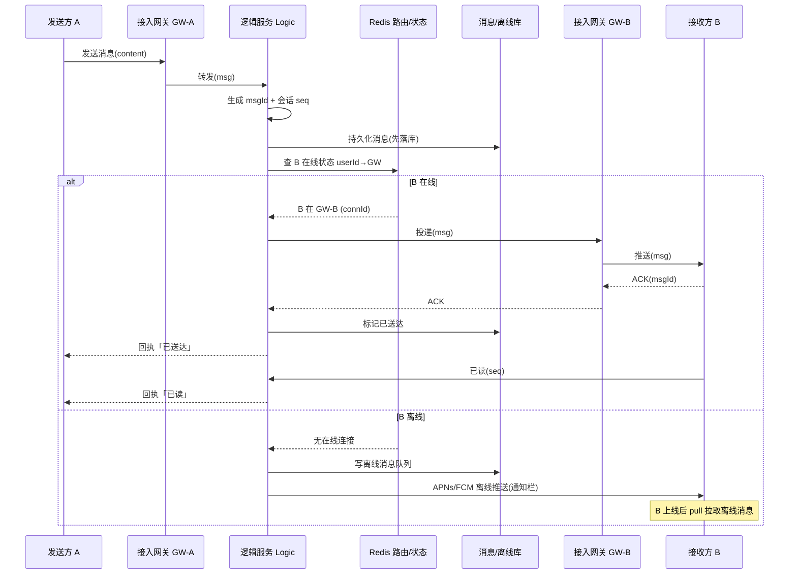

# 04 · IM 即时通讯 / 消息推送（IM & Push）

> **核心理念：一切围绕「长连接」和「消息可靠投递」两条主线展开。**
> 答题方法：**先拆大步骤（需求 → 长连接怎么建 → 消息怎么流转 → 怎么保证不丢不重不乱 → 群聊/存储/推送 → 难点权衡），每步再拆小步骤**，别一上来就堆技术点。

---

## 一、需求澄清（先问清「做什么」）

| 维度 | 需求 |
|---|---|
| 基础能力 | 即时收发消息（毫秒级）、单聊 / 群聊 |
| 在线状态 | 在线 / 离线，离线消息不丢、上线补拉 |
| 消息状态 | 已发送 / 已送达 / 已读 |
| 规模 | 海量长连接（千万级同时在线）、消息风暴 |
| 可靠性 | **不丢、不重、有序** |
| 多端 | 一个 userId 多设备（手机 + PC + Pad）同时在线 |

**容量估算（举例，方便报数字）：**
- 1 亿 DAU，20% 同时在线 → **2000 万长连接**
- 单机 net gateway 扛 **10 万~100 万连接**（epoll + 少量线程）→ 约 200~2000 台网关
- 人均每天 100 条消息 → 100 亿条/天 ≈ **12 万 QPS 写**，峰值再 ×5

---

## 二、总体架构（分层）

```
                       ┌────────────────────────────┐
   [客户端App]         │        逻辑/业务层           │
   长连接(WS/TCP)      │  Logic Service(单聊/群聊/已读)│
       │               └──────┬─────────────┬────────┘
       ▼                      │             │
┌──────────────┐        ┌─────▼─────┐  ┌────▼─────┐
│ 接入网关       │◀─MQ──▶│ 在线状态/  │  │ 消息存储  │
│ Access Gateway│        │ 路由表     │  │ (时间线)  │
│ (长连接接入)   │        │ Redis     │  │ HBase/... │
└──────┬────────┘        │userId→GW  │  └──────────┘
       │                 └───────────┘        │
       │                                 ┌────▼──────┐
       ▼(离线)                            │ 离线消息库 │
[APNs/FCM/厂商推送]                       └───────────┘
```

- **接入网关（Access Gateway）**：只负责维护长连接、收发帧、心跳，**无状态化业务**，可水平扩展。
- **逻辑服务（Logic Service）**：处理单聊/群聊/已读/好友校验等业务，查在线状态并决定推给谁。
- **路由表（Redis）**：`userId → 哪台网关的哪个连接`，是「找人」的关键。
- **存储层**：消息时间线、离线消息、历史消息分页。

---

## 三、★ 长连接（重点：为什么、怎么保活、怎么找人）

### 3.1 为什么用 WebSocket / TCP 长连接（对比轮询）

IM 的本质诉求是**服务端要能主动把消息推给客户端**，HTTP 请求-响应模型做不到，只能对比几种方案：

| 方案 | 原理 | 实时性 | 服务端压力 | 结论 |
|---|---|---|---|---|
| **短轮询 Polling** | 客户端每隔 N 秒发一次 HTTP 问「有新消息吗」 | 差（有 N 秒延迟） | 大量无效请求 | ❌ 浪费 |
| **长轮询 Long-Polling** | 请求 hold 住，有消息才返回，否则超时再重连 | 较好 | 每条消息一次 HTTP，连接反复建立 | 🔸 兜底方案 |
| **WebSocket / TCP 长连接** | 一次握手后**全双工**，服务端可随时 push | 最好（毫秒级） | 连接常驻，省去反复握手 | ✅ 主流 |

**面试一句话**：轮询是「客户端拉」，做不到服务端主动、实时性差且请求浪费；IM 要**服务端主动推**，所以用 WebSocket（或自研 TCP 私有协议，省 HTTP 头、更省流量，微信/QQ 走这条）。

### 3.2 心跳保活（Heartbeat / KeepAlive）

- **为什么**：NAT / 运营商网关会把空闲 TCP 连接**悄悄断掉**（几分钟无数据就回收），且 TCP 本身对端崩溃时己方不感知 → 需要应用层心跳探活。
- **怎么做**：客户端定时发 `ping`，服务端回 `pong`；服务端维护每连接的 `lastActiveTime`，超时未收心跳则**判定掉线、清理连接和路由表**。
- **智能心跳**：心跳间隔太短费电费流量，太长又易被 NAT 回收 → 动态探测最大存活间隔（如微信）。

### 3.3 连接与用户/设备的映射（路由表，关键中的关键）

网关水平扩展后，「用户 A 的连接到底在哪台网关」必须能查到，否则消息推不出去。

```
Redis 路由表（Session Registry）:
  route:userId:1001  →  { gw-07: connId-abc (手机),
                          gw-12: connId-xyz (PC) }   ← 多端
```

- 用户上线：网关把 `userId → (本机ID, connId, deviceType)` **写入 Redis**（带 TTL，靠心跳续期）。
- 用户下线/心跳超时：**删除**对应映射。
- 发消息时：逻辑服务用 `userId` 查 Redis → 得到目标网关 → 把消息投给那台网关 → 网关按 connId 找到 socket 推下去。
- **多端同步**：一个 userId 可能映射多条连接，消息要推给**全部在线设备**。

---

## 四、★ 消息流转（核心：一条消息怎么从 A 到 B）

### 4.1 文字流程

```
1. A 发消息 → 本机网关 GW-A
2. GW-A → 逻辑服务：校验/生成 msgId + 会话内 seq → 持久化消息（先落库再投递）
3. 逻辑服务查 B 的在线状态（Redis 路由表）
   ├─ B 在线：找到 B 所在网关 GW-B → 推给 GW-B → GW-B 推给 B
   └─ B 离线：写入【离线消息库】，触发 APNs/FCM 推送角标/通知
4. B 收到后回 ACK → 逻辑服务标记「已送达」，删除该消息的待确认态
5. A 收到「已送达」回执；B 打开会话回「已读」→ A 收到「已读」
```

> **要点**：**先持久化，再投递**（Store-then-Forward）。哪怕投递失败，消息已在库里，可重推、可离线拉取，这是「不丢」的基石。

### 4.2 消息投递时序图（Mermaid）



---

## 五、消息可靠性（不丢 / 不重 / 有序，面试高频）

> **三板斧**：ACK + 重传 + 去重 + 会话内序列号。

### 5.1 不丢（可靠投递）

- **应用层 ACK**：不能信 TCP 的 ACK（TCP 只保证到内核缓冲区，App 崩了照样丢）。每条消息业务层回 ACK。
- **重传 + 超时**：发出后进「待确认队列」，超时未收 ACK 则**重传**（客户端拉取/服务端补推）。
- **离线存储兜底**：接收方不在线 → 落离线库，上线主动 pull。
- 落库时机：**先落库、后投递**（见 4.1）。

### 5.2 不重（幂等去重）

- 重传天然会带来重复 → **接收端按 `msgId` 去重**（客户端本地 + 服务端幂等表）。
- `msgId` 用全局唯一 ID（雪花算法 / Leaf），保证幂等。

### 5.3 有序（会话内有序）

- **不追求全局有序**（代价太大），只保证**同一会话内有序**。
- 逻辑服务为每个会话维护单调递增 **`seq`**（会话级序列号），客户端按 seq 排序、补洞（发现 seq 跳号→拉取缺失段）。
- 生成 seq：Redis `INCR conv:seq:{convId}`，或分片发号器。

```
会话 conv_123 的消息:  seq=1  seq=2  seq=3  seq=4 ...
客户端收到 1,2,4 → 发现缺 3 → 主动拉取 seq=3
```

---

## 六、群聊：写扩散 vs 读扩散（推 vs 拉）

一条群消息发给 N 个成员，两种落地策略：

| 方案 | 写扩散（推 Push / Fan-out on Write） | 读扩散（拉 Pull / Fan-out on Read） |
|---|---|---|
| 做法 | 发消息时**给每个成员的收件箱各写一份** | 只存**一份**到群信箱，成员各自来拉 |
| 读取 | 读自己收件箱即可，快 | 读时聚合群消息，重 |
| 写放大 | **大**（N 人群写 N 次） | 小（写 1 次） |
| 适合 | **小群、普通群**（多数 IM 单聊+群聊主流） | **超大群 / 万人群 / 直播弹幕** |
| 典型 | 微信群（写扩散为主） | 超大群、微博 Feed 类 |

**面试答法**：
- 单聊 + 中小群 → **写扩散**（读快、实现简单，写放大可接受）。
- 万人/十万人大群 → **读扩散**（否则一条消息写十万次收件箱，写风暴），或**混合**：活跃成员推、非活跃拉。

---

## 七、在线状态与路由（水平扩展）

- **状态存 Redis**：`userId → gateway + connId + deviceType`，TTL + 心跳续期，掉线即删。
- **网关无状态、可水平扩展**：网关只管连接，业务在逻辑层 → 加机器即可扛更多连接。
- **网关间通信**：逻辑服务算出「目标在 GW-B」后，通过 **MQ / RPC** 把消息投给 GW-B（网关订阅自己的投递通道）。
- **状态变更通知**：上线/下线事件发给关心方（好友、群），更新「在线」小绿点。

---

## 八、存储设计

| 数据 | 存储 | 说明 |
|---|---|---|
| 消息时间线（Timeline） | HBase / Cassandra / 分库分表 MySQL | 按 `convId + seq` 存，天然有序，海量写友好 |
| 离线消息 | Redis / 独立库 | 按 `userId` 存待拉取消息，上线 pull 后删 |
| 历史消息分页 | 按 `convId + seq` 游标翻页 | **用 seq/时间戳做游标**，别用 `OFFSET`（深分页慢） |
| 已读位点 | `userId + convId → readSeq` | 记录每人在每会话读到哪 |

- **扩散写**：写扩散场景，每个用户一条时间线（收件箱）。
- **冷热分离**：近期消息热存，历史归档到廉价存储。

---

## 九、推送（离线走第三方通道）

- 接收方**离线**时，App 长连接已断 → 走操作系统级推送把「通知栏消息 / 角标」送达：
  - iOS：**APNs**
  - Android：**FCM**（国内不可用）→ 走**厂商推送**（小米 / 华为 / OPPO / vivo）+ **自建长连接保活**兜底。
- 推送内容一般只带「你有 N 条新消息」或摘要，**真正内容等用户点开、App 上线后拉取**（隐私 + 省流量）。

---

## 十、难点与权衡（★ 加分项）

| 难点 | 说明 / 解法 |
|---|---|
| **海量长连接（C10K/C100K）** | 单机连接数是瓶颈：**epoll + IO 多路复用 + Reactor**（Netty），少量线程管百万连接；调内核 `ulimit`/`fd`、内存(每连接几 KB) |
| **消息风暴** | 大群/热点事件瞬时扇出巨大 → **MQ 削峰** + 读扩散 + 合并推送（批量下发） |
| **跨机房 / 异地多活** | 用户可能连不同机房网关 → 路由表全局可见（跨机房 Redis/一致性同步）；消息就近接入、异步同步 |
| **多端同步** | 一条消息推所有在线端 + 各端已读位点同步；换设备补历史 |
| **弱网 / 断线重连** | 重连后按本地最大 seq **增量拉取**缺失消息，避免全量 |
| **在线状态准确性** | 心跳超时才判离线，存在几秒误差；用 TTL + 事件双保险 |

---

## 十一、小结

> **IM = 长连接（连得上、找得到）+ 可靠投递（不丢不重不乱）+ 扩散策略（推/拉）+ 存储与离线推送。**

**核心记忆点：**
1. **长连接**：WebSocket/TCP 让服务端能主动推，心跳保活，Redis 存 `userId→网关` 路由表。
2. **流转**：先落库再投递，在线找网关推、离线存库 + 第三方推送，靠 ACK 确认。
3. **可靠性**：ACK + 重传（不丢）、msgId 去重（不重）、会话 seq（有序）。
4. **群聊**：中小群写扩散、超大群读扩散。
5. **扩展**：网关无状态水平扩展，MQ 解耦削峰。

## 🔗 关联

- 高并发通用方案 → [07-high-concurrency](07-high-concurrency.md)
- 高可用设计 → [06-high-availability](06-high-availability.md)
- 限流细节 → [05-rate-limiter](05-rate-limiter.md)
- Redis 相关 → [../01-cheatsheet/06-redis](../01-cheatsheet/06-redis.md)
