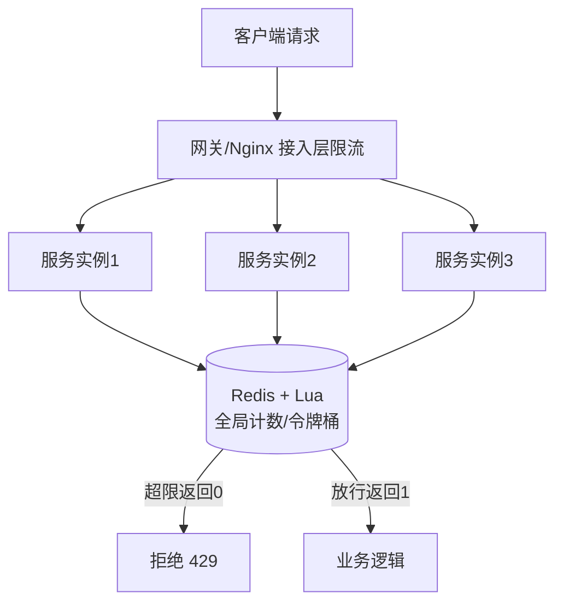

# 05 · 限流系统（Rate Limiter）

> **核心理念：入口处设阈值，超过就拒绝/排队/降级，用局部损失换整体可用。**
> 答题方法：**先讲为什么限流 → 四种算法（重点）→ 单机 vs 分布式（重点）→ 维度/超限处理 → 和熔断降级的配合**。

---

## 一、为什么要限流？

系统的处理能力（CPU、连接数、DB 容量）是**有上限**的。一旦请求量超过这个上限，不加控制会导致：

| 不限流的后果 | 说明 |
|---|---|
| 系统被打垮 | 突发流量（秒杀、热点）瞬间压满线程池/连接池，响应变慢直至 OOM/宕机 |
| 恶意流量 | 爬虫、刷单、CC 攻击拖死正常用户 |
| 级联雪崩 | 一个服务被拖慢，调用方线程堆积，故障沿调用链扩散 |

**限流（Rate Limiting）的本质**：给系统入口设一个**安全阈值**，超过阈值的请求就**拒绝 / 排队 / 降级**——宁可**牺牲一部分请求，也要保住整体可用**（有损服务优于全站崩溃）。

> 一句话：限流是**给系统上保险丝**，把流量削到系统扛得住的水位线。

---

## 二、★ 四种核心限流算法（重点）

### 算法 1 · 固定窗口计数器（Fixed Window Counter）

**原理**：把时间切成固定窗口（如每 1 秒），每来一个请求给该窗口计数 +1，超过阈值就拒绝，窗口结束计数清零。

```java
// 伪代码：每秒限 100 个请求
if (now - windowStart >= 1000) {   // 进入新窗口
    windowStart = now;
    count = 0;
}
if (++count > 100) reject();       // 超阈值拒绝
else pass();
```

- ✅ **优点**：实现极简，一个计数器搞定，内存省。
- ❌ **缺点**：**临界问题（Boundary Burst）**——在窗口交界处可能放过 **2 倍**流量。
  ```
  阈值 100/s：
  |----窗口1----|----窗口2----|
              ↑ 后 0.5s 打 100    ↑ 前 0.5s 又打 100
       → 中间这 1 秒实际通过了 200 个请求！
  ```
- **适用**：对精度要求不高、追求简单的场景（如粗粒度日调用量控制）。

---

### 算法 2 · 滑动窗口（Sliding Window）

**原理**：把固定窗口再**细分成多个小格子（slot）**，窗口随时间平滑向前滑动，统计的是「当前时刻往前一个完整窗口」内所有小格子的计数之和。格子越细，越接近真实速率，临界问题越轻。

```
固定窗口：整格清零 → 有临界跳变
滑动窗口：窗口随时间滑动，只统计最近 1s 的格子之和
  [·][·][·][·][·][·]  ← 每 100ms 一格，滑动求和
   ↑ 老格子滑出，新格子滑入，总和平滑
```

- ✅ **优点**：**缓解固定窗口的临界问题**，统计更平滑精确。
- ❌ **缺点**：格子越细内存/计算开销越大；仍是「统计型」，不控制流出速率。
- **适用**：需要较精确 QPS 控制的场景（**Sentinel 的滑动窗口**即用此思路统计）。

> Redis 可用 **ZSET**（score 存时间戳）实现精确滑动窗口：`ZREMRANGEBYSCORE` 清理过期，`ZCARD` 统计当前窗口请求数。

---

### 算法 3 · 漏桶（Leaky Bucket）

**原理**：请求先进桶（队列），桶以**固定速率匀速流出**（处理）；桶满则溢出（拒绝）。无论进水多猛，出水始终恒定。

```
   请求(忽快忽慢) →→→ ┌─────┐
                      │  ▓  │  桶（缓冲队列，容量有限）
                      │  ▓  │
                      └──┬──┘
                         ↓ 匀速流出（恒定速率处理）
```

- ✅ **优点**：**强制平滑输出**，无论入口多突发，下游始终收到匀速流量——保护下游最彻底。
- ❌ **缺点**：**不能应对突发**——即使桶空、系统很闲，也只能匀速放行，突发流量只能排队等待，实时性差。
- **适用**：需要**严格恒定速率**保护下游的场景（如对第三方 API 严格限速、匀速消费）。

---

### 算法 4 · 令牌桶（Token Bucket）★ 最常用

**原理**：系统以**固定速率向桶里放令牌**，桶有容量上限；每个请求要先**取一个令牌**才能通过，取不到就拒绝/等待。桶里平时积攒的令牌，让它**能应对突发**。

```
   匀速生成令牌 ↓（r 个/秒）
              ┌─────┐
              │ ●●● │  桶（容量 = 允许的突发量）
              └──┬──┘
   请求 → 取令牌 ─┘ 取到→放行；取不到→拒绝
```

```java
// Guava RateLimiter：令牌桶实现
RateLimiter limiter = RateLimiter.create(100); // 每秒放 100 个令牌
if (limiter.tryAcquire()) pass();              // 非阻塞：取到就过
else reject();                                 // 取不到就拒
// limiter.acquire();                          // 阻塞式：等到有令牌
```

- ✅ **优点**：**允许一定突发**（桶中积攒的令牌可瞬间消费），又能限制长期平均速率，灵活性最好——**最常用**。
- ❌ **缺点**：突发时下游可能瞬间收到桶容量那么多请求，对下游冲击不如漏桶平滑。
- **适用**：绝大多数接口限流（**Guava RateLimiter**、**Sentinel 匀速排队/预热**、Nginx `limit_req` 的 burst 本质都带令牌桶思想）。

---

### 令牌桶 vs 漏桶（★ 高频对比）

| 维度 | 漏桶 Leaky Bucket | 令牌桶 Token Bucket |
|---|---|---|
| 核心 | 桶里装**请求**，匀速流出 | 桶里装**令牌**，匀速生成 |
| 出口速率 | **恒定匀速**，不可突破 | 平均恒定，**允许瞬时突发** |
| 突发流量 | ❌ 不允许，只能排队 | ✅ 允许（消费积攒的令牌） |
| 保护对象 | 强保护下游（削峰彻底） | 平衡吞吐与保护 |
| 典型实现 | Nginx `limit_req`（无 burst 时） | **Guava RateLimiter**、Sentinel |

> 一句话记忆：**漏桶强制匀速（怕下游被冲垮），令牌桶允许突发（想充分利用余量）**。二者区别的关键就是**能不能突发**。

---

## 三、★ 单机限流 vs 分布式限流（重点）

### 单机限流（Local / Standalone）

限流器状态在**本进程内存**里，只约束**当前这一个实例**。

| 工具 | 说明 |
|---|---|
| **Guava RateLimiter** | 令牌桶，控制单机 QPS：`RateLimiter.create(100)` |
| **Semaphore** | 信号量，控制**并发数**（同时进入的线程数）：`new Semaphore(50)` |
| **Sentinel（单机模式）** | 滑动窗口统计 + 多种流控规则 |

- ✅ 简单、无网络开销、性能高。
- ❌ **只限本实例**：集群 N 台机器各限 100，全局实际放行 = **N × 100**，无法控制**全局总量**。
  ```
  真实阈值想控 100/s，但 5 台机器各自 RateLimiter.create(100)
  → 全局放行 500/s，限流形同虚设！
  ```
- **适用**：无需全局精确、能接受「阈值 × 实例数」的场景，或作为分布式限流的**兜底本地防线**。

---

### 分布式限流（Distributed）

多实例**共享同一份全局计数**，才能控制集群总流量。核心思路：把「计数/令牌」这个状态**外置到共享存储或统一网关**。

#### 方案 A：Redis + Lua（最主流）★

把「读计数 → 判断 → 写计数」封装进一段 **Lua 脚本**，利用 Redis **单线程执行 Lua 的原子性**，避免并发下的 read-modify-write 竞态。

**思路 1 · 固定窗口计数（简单）**：

```lua
-- KEYS[1]=限流key（如 rate:api:userA:窗口秒数）
-- ARGV[1]=阈值 limit   ARGV[2]=窗口秒数 window
local current = redis.call('INCR', KEYS[1])
if current == 1 then
    redis.call('EXPIRE', KEYS[1], ARGV[2])  -- 第一次设过期，窗口自动重置
end
if current > tonumber(ARGV[1]) then
    return 0   -- 超限，拒绝
end
return 1        -- 放行
```

**思路 2 · 令牌桶（更平滑，允许突发）**：脚本里存「当前令牌数 + 上次刷新时间」，每次请求先按 `(now-last)*rate` 补令牌（不超容量），够则扣减放行、不够则拒绝——全部在一段 Lua 里原子完成。

- ✅ 全局统一计数，精确控制集群总量；Redis 性能高，天然共享。
- ❌ 引入 Redis 网络往返（增加 RT）；**Redis 单点/故障**要考虑（降级为本地限流兜底）。

#### 方案 B：网关/中间件集群流控

| 方案 | 说明 |
|---|---|
| **Sentinel 集群流控** | Token Server 统一发放令牌，各应用作为 Token Client 上报申请，实现**集群维度总量控制** |
| **Nginx `limit_req`** | 接入层限流，`limit_req_zone` 按 key 限速；多 Nginx 需配 Redis 或用 OpenResty + 共享字典 |
| **API 网关**（Kong/Spring Cloud Gateway/Higress） | 网关插件统一限流，通常底层也接 Redis 计数 |

```nginx
# Nginx 接入层限流：每 IP 10r/s，允许 burst 20（令牌桶思想）
limit_req_zone $binary_remote_addr zone=api:10m rate=10r/s;
location /api/ {
    limit_req zone=api burst=20 nodelay;
}
```

#### 分布式限流架构示意



> 记忆：**单机限流管「本实例」，分布式限流管「集群总量」；分布式的关键是把计数状态外置（Redis+Lua 原子 / Token Server 统一发令牌）。**

---

## 四、限流维度

限流不是只有「全局 QPS」一个口子，常按维度组合：

| 维度 | 说明 / 场景 |
|---|---|
| **QPS / TPS** | 每秒请求/事务数（最常见） |
| **并发数** | 同时处理的请求数（Semaphore / Sentinel 线程数模式）——防慢调用堆积 |
| **按 IP** | 防单 IP 刷接口、CC 攻击（Nginx `$binary_remote_addr`） |
| **按用户 / API-Key** | 多租户配额、开放平台按 key 限速 |
| **按接口 / 资源** | 核心接口宽松、非核心接口收紧 |
| **按租户 / 应用** | SaaS 场景保证租户间隔离，防单租户占满 |

---

## 五、超限了怎么处理？

| 处理方式 | 说明 | 适用 |
|---|---|---|
| **拒绝（Reject）** | 直接返回 **HTTP 429 Too Many Requests**，可带 `Retry-After` | 大多数只读/查询接口 |
| **排队（Queue）** | 请求进队列匀速处理（漏桶/Sentinel 匀速排队），超时再拒 | 写请求、消息削峰、秒杀下单 |
| **降级（Degrade）** | 走简化逻辑/关闭非核心功能，保核心链路 | 大促关闭推荐、评论等边缘功能 |
| **返回兜底（Fallback）** | 返回缓存/默认值/静态兜底页（如"排队中，请稍后"） | 首页、商品页等要求可用性的场景 |

> 面试加分：拒绝时返回 **429** 并带 `Retry-After` 头，比直接 500 更规范；客户端应做**指数退避重试**。

---

## 六、限流 vs 熔断 vs 降级（区别与配合）

三者常一起出现，容易混：**它们解决的是不同问题，配合使用**。

| 机制 | 触发原因 | 作用对象 | 目的 |
|---|---|---|---|
| **限流** Rate Limit | 流量**超过阈值** | **入口流量** | 挡住过量请求，别把自己压垮 |
| **熔断** Circuit Break | **依赖故障**（错误率/超时高） | **对下游的调用** | 快速失败，别被故障依赖拖死 |
| **降级** Degrade | 限流/熔断触发 or 系统压力大 | **业务功能** | 返回兜底，保核心可用 |

**配合关系**：
```
请求进来 → [限流] 挡住超量流量（保护入口）
         → 调用下游 → [熔断] 发现下游故障就快速失败（防级联）
         → 触发后 → [降级] 返回兜底结果（保用户体验）
```

> 一句话：**限流控入口（流量维度），熔断切故障依赖（可用性维度），降级返兜底（体验维度）。** 三者是「流量太大 / 依赖坏了 / 都不行时给个兜底」的分工。详见 [06-high-availability](06-high-availability.md)。

---

## 七、框架与技术选型

| 场景 | 推荐 |
|---|---|
| 单机限流（Java） | **Guava RateLimiter**（令牌桶）、`Semaphore`（并发数） |
| 应用级流控 + 熔断降级一体 | **Sentinel**（滑动窗口/匀速排队/预热/集群流控，规则可动态配） |
| 接入层限流 | **Nginx** `limit_req`（漏桶+burst）、OpenResty |
| 分布式全局限流 | **Redis + Lua** 原子脚本 / Sentinel 集群流控（Token Server） |
| API 网关 | Kong、Spring Cloud Gateway、Higress（插件式限流，底层多接 Redis） |

---

## 八、面试速答模板

被问「如何设计一个限流系统」按这个顺序答：

1. **为什么**：保护系统，超阈值拒绝/排队/降级，有损换可用。
2. **选算法**：要允许突发选**令牌桶**（Guava）；要严格匀速保护下游选**漏桶**；要精确 QPS 用**滑动窗口**（Sentinel）；固定窗口简单但有**临界问题**。
3. **单机还是分布式**：单机用 Guava/Semaphore，只限本实例；集群要全局总量控制用 **Redis + Lua**（原子计数/令牌桶脚本）或 **Sentinel 集群流控**。
4. **维度**：QPS/并发/IP/用户/接口/租户按需组合。
5. **超限处理**：429 拒绝 + `Retry-After` / 排队 / 降级兜底。
6. **和熔断降级配合**：限流控入口、熔断切故障、降级保体验。

---

## 🔗 关联

- 高并发整体设计 → [07-high-concurrency](07-high-concurrency.md)
- 高可用 / 熔断降级 → [06-high-availability](06-high-availability.md)
- 秒杀实战（限流削峰） → [02-seckill](02-seckill.md)
- Redis 相关 → [../01-cheatsheet/06-redis](../01-cheatsheet/06-redis.md)
