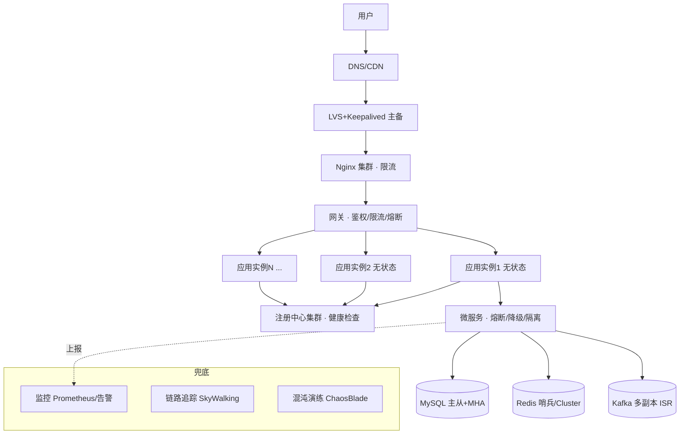

# 06 · 服务高可用设计（High Availability）

> 中高级 / 架构必问。**高可用 = 用「冗余 + 自动故障转移」消除单点，用「限流/熔断/降级/隔离」控制故障爆炸半径。**
> 答题主线:**先讲目标(几个9) → 再讲手段(冗余/柔性/隔离/多活) → 落到各层怎么做 → 配监控演练兜底。**

---

## 🔥 高频必背(Top 12)

| 问题 | 一句话答 |
|---|---|
| **什么是高可用** | 系统在**部分组件故障时仍能持续对外提供服务**的能力,核心是**消除单点 + 快速故障恢复**。 |
| **怎么衡量** | 用 **SLA(可用性百分比)**,即「几个9」。可用性 = MTBF /(MTBF+MTTR);降 MTTR(平均恢复时间)比升 MTBF 更实际。 |
| **四个9是多少** | 99.99% ≈ 全年宕机 **52.6 分钟**;三个9 ≈ 8.76 小时;五个9 ≈ 5.26 分钟。 |
| **高可用两大方向** | ① **冗余**(多副本、无单点、故障转移);② **柔性可用**(限流、熔断、降级、隔离——保核心弃非核心)。 |
| **限流** | 保护系统不被打垮,控制入口流量。算法:**计数器/滑动窗口/漏桶/令牌桶**。详见 [限流](05-rate-limiter.md)。 |
| **熔断** | 下游故障时**快速失败**,不再无谓调用,给下游恢复时间。三态:**关闭→打开→半开**。 |
| **降级** | 牺牲非核心功能/一致性,**保核心链路可用**(如大促关掉评价、退化返回兜底数据)。 |
| **隔离** | 把故障**限制在局部**:线程池隔离、信号量隔离、集群/机房隔离、快慢分离。 |
| **超时+重试+幂等** | 必须设超时(防雪崩);重试要配**退避 + 幂等**,否则放大故障、重复扣款。 |
| **故障转移(Failover)** | 主挂了自动切备:Redis 哨兵、MySQL MHA/MGR、注册中心摘除不健康节点。 |
| **异地多活** | 多机房同时对外服务、互为灾备,解决**机房级**故障;难点在**数据同步与冲突**。 |
| **雪崩怎么防** | 超时 + 熔断 + 限流 + 隔离 + 降级,五件套一起上;缓存侧防穿透/击穿/雪崩。 |

> **一句话总纲(能背出口)**:*高可用 = 冗余消单点 + 柔性保核心 + 隔离控爆炸半径 + 监控演练兜底。*

---

## 📌 展开速答

### 1. 可用性怎么算?「几个9」对应多少宕机时间?

**可用性 = 正常运行时间 /(正常 + 故障时间) = MTBF /(MTBF + MTTR)**
- **MTBF**:平均无故障时间(越大越好)。**MTTR**:平均修复时间(越小越好)。
- 工程上**降 MTTR 更可控**——所以自动故障转移、快速回滚、完善监控比"追求不出故障"更重要。

| 可用性 | 全年宕机 | 典型定位 |
|---|---|---|
| 99%(两个9) | 3.65 天 | 内部系统 |
| 99.9%(三个9) | 8.76 小时 | 一般在线服务 |
| 99.99%(四个9) | 52.6 分钟 | 核心业务常见目标 |
| 99.999%(五个9) | 5.26 分钟 | 电信/金融级 |

### 2. 冗余与无单点:高可用的地基

**原则:任何组件都不能只有一个实例。** 逐层去单点:

- **接入层**:DNS 轮询 / 多 VIP;LVS+Keepalived 主备(VRRP);Nginx 多实例。
- **应用层**:**无状态化** + 多实例 + 负载均衡(会话放 Redis,不放本地内存,才能随意扩缩容/摘除)。
- **服务层**:注册中心(Nacos/Eureka)+ 健康检查,自动摘除不健康节点。
- **数据层**:MySQL 主从/MGR、Redis 主从+哨兵/Cluster、消息队列多副本(Kafka ISR)。

> **加分**:强调"**无状态是水平扩展和故障转移的前提**",有状态服务(DB/缓存)才需要额外的复制+选主机制。

### 3. 柔性可用四板斧:限流 / 熔断 / 降级 / 隔离

这是面试重灾区,务必分清**区别**:

| 手段 | 解决什么 | 触发方 | 类比 |
|---|---|---|---|
| **限流** | 入口流量过大,防自己被打垮 | **上游/入口** | 景区限制每天入园人数 |
| **熔断** | **下游**故障,防被拖死、给下游喘息 | 调用方感知下游 | 保险丝跳闸 |
| **降级** | 资源不足时**弃车保帅** | 主动/被动 | 停掉非核心服务 |
| **隔离** | 防一个故障蔓延全局 | 资源划分 | 轮船水密舱 |

- **限流算法**(高频):计数器→滑动窗口→漏桶(恒定速率)→令牌桶(允许突发)。单机用 Guava `RateLimiter`,分布式用 Redis+Lua / Sentinel。→ [05-rate-limiter](05-rate-limiter.md)
- **熔断三态**:**Closed(正常)** → 失败率超阈值 → **Open(快速失败)** → 冷却后 → **Half-Open(放少量试探)** → 成功则回 Closed。工具:Sentinel / Resilience4j(Hystrix 已停更)。
- **降级**:开关降级(配置中心一键切)、限流降级、故障降级(调用失败走兜底)、读降级(返回缓存/默认值)、写降级(异步/丢弃非关键写)。
- **隔离**:**线程池隔离**(每个依赖独立线程池,一个满了不拖垮其他)、**信号量隔离**(轻量,无线程切换)、**机房/集群隔离**、**核心与非核心隔离**(交易和日志分离部署)。

### 4. 超时、重试、幂等:调用链的三件套

- **超时**:每一跳必设 connect/read timeout。**没有超时 = 线程被拖住 = 雪崩起点**。
- **重试**:只对**可重试错误**(网络抖动/超时)重试;配 **指数退避 + 抖动**,限制次数;下游熔断时别重试(火上浇油)。
- **幂等**:重试和消息重投的前提。实现:**唯一键 + 数据库唯一索引**、**去重表/Token**、**状态机流转**、Redis `SETNX`。→ 详见 [Redis 分布式锁](../01-cheatsheet/06-redis.md)

### 5. 数据层高可用(最关键也最难)

| 组件 | 高可用方案 | 关键点 |
|---|---|---|
| **MySQL** | 主从复制 + MHA / **MGR** / 半同步复制 | 防丢数据用**半同步**;读写分离扩读;故障转移选主 |
| **Redis** | 主从 + **哨兵(Sentinel)** / **Cluster** | 哨兵负责故障转移;Cluster 分片+去中心化 |
| **Kafka** | 多副本 + **ISR** + `acks=all` | Leader 挂了从 ISR 选新 Leader |
| **注册中心** | 集群部署(Nacos/ZK) | **CP vs AP** 取舍:ZK 偏 CP,Eureka/Nacos(AP)可用性优先 |

> **加分**:提 **CAP 权衡**——注册中心/配置中心在网络分区时,选 AP(优先可用,可能读到旧数据)还是 CP(优先一致,分区时不可用)是经典设计题。

### 6. 异地多活(同城双活 / 异地多活)

解决**机房/城市级**灾难。演进路线:

```
单机房 → 同城双活(双机房,低延迟,数据同步简单)
       → 两地三中心(灾备,平时不接流量)
       → 异地多活(多地同时对外,互为灾备)★难点
```

- **难点**:**数据同步延迟 + 冲突**。方案:按 **用户/地域分片(单元化 unitization)**,让一个用户的读写尽量落在同一单元,减少跨机房调用;全局数据(如库存)做特殊处理。
- **典型**:阿里单元化、饿了么多活。面试能说清"**单元化 + 就近路由 + 数据分层同步**"即可。

### 7. 部署与发布层面的高可用

- **灰度发布 / 金丝雀**:小流量验证再全量,出问题只影响少量用户。
- **蓝绿部署**:两套环境切流量,可秒级回滚。
- **滚动发布**:分批替换实例,配合健康检查。
- **可回滚**:任何变更都要能**快速回滚**(降 MTTR 的关键)。

### 8. 监控告警与故障演练(兜底)

- **可观测三支柱**:Metrics(Prometheus)、Logging(ELK)、Tracing(SkyWalking/链路追踪)。
- **告警分级** + 值班;核心指标:QPS、RT、错误率、饱和度(USE/RED 方法)。
- **混沌工程 / 故障演练**:主动注入故障(ChaosBlade),验证预案真的有效——**没演练过的高可用都是纸面高可用**。

---

## ⚠️ 易错 / 反问加分

- **限流 vs 熔断 vs 降级 分不清**:一句话——**限流管入口、熔断防下游、降级保核心、隔离控范围**。面试最爱追问区别,必须张口就来。
- **只说"加机器/上集群"**:那只是冗余一层。要体现**分层去单点 + 柔性策略 + 数据一致性权衡**的系统性思维。
- **重试不加幂等/退避**:反被追问"重试会不会重复扣款/加剧雪崩",答不上直接扣分。
- **忽略数据层**:应用层无状态好做,**面试深度全在 DB/缓存/MQ 的复制与选主**。
- **忽视 MTTR**:一味强调"不宕机"不现实,主动提"**降低恢复时间**(自动故障转移、快速回滚、监控告警)"是成熟度信号。
- **健康检查要「深」**:别只检端口存活,要检**依赖(DB/下游)是否正常**,否则会把"假活着"的节点留在集群里。
- **反问加分点**:主动提 **CAP/BASE 权衡**、**单元化多活**、**混沌演练**、**优雅下线(先摘流量再停服务,防请求打到正在关闭的实例)**,展示广度。

---

## 🗺️ 高可用架构全景图



**看图记忆链路**:每一层都**去单点 + 有故障转移**,入口层**限流**、服务层**熔断降级隔离**、数据层**多副本选主**、全局**监控演练**兜底。

---

## 🎯 30 秒总结话术(面试直接背)

> "高可用我一般从**四个层次**答:
> ① **目标**——用 SLA 几个9 量化,重点是靠自动故障转移**降低 MTTR**;
> ② **冗余去单点**——从接入层到数据层每层多副本,应用**无状态**化,DB/缓存/MQ 做主从和选主;
> ③ **柔性可用**——入口**限流**、对下游**熔断**、资源紧张时**降级**保核心、用线程池/机房**隔离**控制爆炸半径,调用链配**超时+退避重试+幂等**;
> ④ **兜底**——完善监控告警、灰度发布可回滚、定期**混沌演练**验证预案。
> 再往上就是**同城双活 / 异地多活的单元化**架构,解决机房级容灾。"

---

## 🔗 关联

- 限流细节 → [05-rate-limiter](05-rate-limiter.md)
- 秒杀高并发(高可用综合实战)→ [02-seckill](02-seckill.md)
- Redis 主从/哨兵/Cluster/分布式锁 → [../01-cheatsheet/06-redis](../01-cheatsheet/06-redis.md)
- MySQL 高可用/主从 → [../01-cheatsheet/05-mysql](../01-cheatsheet/05-mysql.md)
