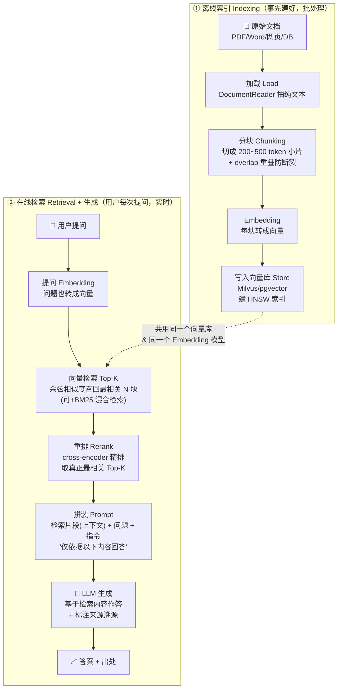

# 03 · RAG 检索增强 速答（Retrieval-Augmented Generation）

> **RAG = 给大模型开卷考试**：答题前先去知识库"翻书"（检索相关片段），把书上的原文塞进 Prompt 再让模型作答。治幻觉、补时效、接私域知识、比微调便宜。本篇覆盖 ~28 个高频考点（RAG 是后端 AI 面试**几乎必问、最拉分**的一篇），全部「能背出口」。深度实现见 [`../../ai-learning/spring-ai-learning`](../../ai-learning/spring-ai-learning) 的 `09-embedding`、`10-vector-store`、`11-rag-etl`。

## 🔥 高频必背（Top 16）

| # | 问题 | 一句话答 |
|---|---|---|
| 1 | 什么是 RAG？ | **检索增强生成**：先从知识库检索相关内容，再把它拼进 Prompt 让 LLM 基于这些内容作答。类比**开卷考试**——先翻书再答题。 |
| 2 | 为什么要 RAG（解决什么）？ | ①**治幻觉**（给依据不瞎编）②**补时效**（模型训练有截止日，RAG 接实时/最新数据）③**接私域**（企业内部/个人知识，模型没学过）④**可溯源**（能标出处）。 |
| 3 | RAG 两大阶段？ | **离线索引**（文档→分块→Embedding→写向量库，事先建好）+ **在线检索**（提问→Embedding→检索 Top-K→拼 Prompt→LLM 生成，实时）。 |
| 4 | 什么是 Chunking（分块）？ | 把长文档切成**小片段**再入库。因为①Embedding/上下文有长度上限 ②检索要定位到"精准的一小段"而非整篇。类比**分页/切片**。 |
| 5 | 块太大 / 太小分别什么问题？ | 太大→**检索不精**（一段里混多个主题、噪音多）、塞不下、贵；太小→**语义断裂**（一句话被切两半，丢上下文）。经验值 200~500 token/块。 |
| 6 | overlap（重叠）干嘛的？ | 相邻块**留一段重叠**（如 10~20%），防止关键句正好被切在块边界导致语义割裂；代价是冗余变多。 |
| 7 | 什么是 Embedding？ | 把文本转成一个**高维向量**（如 1536 维），语义相近的文本向量距离也近。是"语义"的数字指纹。 |
| 8 | 向量检索怎么算相似？ | 算查询向量与库中向量的**余弦相似度**（或点积/欧氏距离），取最相似的 **Top-K** 返回。≈**带索引的相似度查询**。 |
| 9 | 什么是向量数据库？ | 专门存向量 + 做**近似最近邻（ANN）**检索的库（Milvus/pgvector/Redis/Elasticsearch）。用 HNSW/IVF 等索引把"全量比对"降成"近似快查"。 |
| 10 | 什么是 Top-K / 相似度阈值？ | Top-K=召回最相似的前 K 条（常 3~10）；阈值=相似度低于某值就丢弃，防止"硬凑够 K 条"把无关内容也塞进去。 |
| 11 | 什么是 Rerank（重排）？ | 向量粗召回 Top-N 后，用**重排模型**（cross-encoder）对这几十条**精排**，取真正最相关的 Top-K 进 Prompt。≈**二次排序**，先粗筛再精筛。 |
| 12 | 什么是混合检索（Hybrid）？ | **向量检索（语义）+ 关键词检索 BM25（字面）** 融合。向量擅长近义/语义，BM25 擅长精确词/专有名词/编号，二者互补。 |
| 13 | RAG vs 微调（Fine-tuning）怎么选？ | RAG 补**"知识"**（动态、可溯源、便宜、随时更新）；微调改**"能力/风格/格式"**（固定、贵、要数据）。**通常先上 RAG**，风格/领域能力不够再微调。 |
| 14 | RAG 幻觉就没了吗？ | **没有**。检索内容错/缺/冲突，模型照样会错；检索到但"没用上"也会瞎编。RAG 是大幅降低不是根除，还要评估兜底。 |
| 15 | RAG 怎么评估？ | 分两段：**检索**看召回率/精确率/命中率；**生成**看 faithfulness（答案是否忠于检索内容、有没有编）、answer relevance（切不切题）。工具思路：**RAGAS**。 |
| 16 | RAG 里 ETL 管道指什么？ | 文档处理流水线：**Read 读取**（PDF/Word/网页）→ **Transform 转换/清洗/切分** → **Write 写入向量库**。Spring AI 里就是 `DocumentReader → Splitter → VectorStore`。 |

## 🔄 RAG 全流程（必画）

> **一句话串起来**：离线把书拆成便签、贴上语义标签存进"书架"（向量库）；在线时把用户问题也贴上同样的语义标签，去书架里"找最像的几张便签"，精挑几张塞进 Prompt，让模型**照着便签开卷答题并注明出处**。
>
> ⚠️ **关键对齐**：离线入库和在线查询**必须用同一个 Embedding 模型**——向量空间不一致，相似度就没意义（等于用两把不同的尺子量）。

## 📌 展开速答

**Q：为什么不把全部文档直接塞进大模型的长上下文，非要搞 RAG？**
①**贵 + 慢**：塞得越多输入 Token 越多，成本和延迟线性上涨；②**Lost in the Middle**：长上下文里放中间的信息容易被模型忽略（见 [`01-llm-basics`](01-llm-basics.md)）；③**放不下**：企业知识库几十万页，再大的窗口也塞不进；④**无关内容干扰**：全塞进去噪音多，反而降准。RAG 的本质就是**"只塞相关的那几段"**——把"全量硬塞"换成"精准检索"。

**Q：Chunking 到底怎么切才好？**
没有银弹，常见策略：①**固定长度**（按 token/字符切，最简单，可能切断句子）②**按语义/结构切**（按段落、标题、Markdown 章节、句子边界，保语义完整，推荐）③**递归切分**（先按大结构切，超长再往下切）。核心权衡：**块内语义要完整（别断句），块间要能精准定位（别太大混主题）**，配 **overlap** 兜住边界。经验 200~500 token/块、overlap 10~20%，再按检索效果调。父子分块见下。

**Q：向量检索的相似度是怎么回事？和数据库索引像吗？**
文本经 Embedding 变成高维向量，"语义接近"→"向量距离近"。检索就是求**查询向量的最近邻**，用**余弦相似度**衡量（方向越一致越相似）。数据量大时全量两两比对太慢，所以向量库用 **HNSW/IVF 等 ANN 索引**做近似最近邻，牺牲一点精度换大幅提速——**这和 MySQL 用 B+Tree 索引把全表扫描降成快查是一个思想**，只不过这里索引的是"语义相似度"而非"精确值/范围"。

**Q：检索质量不行怎么优化？（这题最能拉分，多答几招）**
分层组合拳：①**混合检索** 向量 + BM25 关键词，专有名词/编号/代码靠 BM25 兜底；②**Rerank 重排** 先粗召回 Top 50，再用 rerank 模型精排取 Top 5，显著提准；③**Query 改写/扩展** 把口语化/含糊的问题改写、拆成多个子问题、多路召回再合并（如 HyDE：先让 LLM 生成一个假设答案再拿去检索）；④**父子分块（small-to-big）** 用**小块**做精准检索命中，命中后把它所属的**大块/父段落**塞进 Prompt，兼顾"检索准"和"上下文全";⑤**元数据过滤** 按部门/时间/文档类型先过滤再向量检索，缩小范围提精度。能说出 3 招以上就很像做过真实项目。

**Q：RAG vs 微调，面试官爱追问，怎么答透？**
一句话：**RAG 管"知道什么"，微调管"怎么表现"**。对照记：

| 维度 | RAG | 微调 Fine-tuning |
|------|-----|-----------------|
| 解决什么 | 补**知识**（事实、私域、最新） | 改**能力/风格/输出格式/领域语感** |
| 更新知识 | **改库即可，实时** | 要重新训练，慢 |
| 可溯源 | ✅ 能标出处 | ❌ 知识"焊死"在权重里 |
| 成本 | 低（建库 + 检索） | 高（标数据 + 训练 + 部署） |
| 幻觉 | 显著降低 | 帮助有限 |

**决策**：需要动态/私域/可溯源知识 → RAG（绝大多数企业场景先选它）；需要固定风格、特定输出格式、垂直领域语感、或想省掉长 Prompt → 微调；两者**可叠加**（微调管风格 + RAG 管知识）。

**Q：RAG 常见的失败模式有哪些？（会答这题=有实战）**
①**召回不到**（检索差，知识库里有但没查出来——分块烂/Embedding 弱/Query 太口语）；②**召回到但没用上**（塞进去了模型却忽略，或被无关块淹没）；③**上下文超长**（Top-K 太多/块太大，塞爆窗口或触发 Lost in the Middle）；④**多文档冲突**（新旧版本/矛盾内容都召回，模型不知道信谁）；⑤**检索内容本身就错**（脏数据入库，garbage in garbage out，照样幻觉）；⑥**答非所问**（检索对了但生成没约束好）。**每一环都可能崩，所以要端到端评估定位是"检索问题"还是"生成问题"**。

**Q：怎么评估一个 RAG 系统好不好？**
拆成**检索**和**生成**两段量：
- **检索层**：Recall（该召回的召回了吗）、Precision/命中率（召回的相关吗）、Context Relevance（片段切不切题）。
- **生成层**：**Faithfulness/忠实度**（答案是否严格基于检索内容、有没有编造——RAG 最关键指标）、**Answer Relevance**（答案切不切题）、正确性。
- **方法**：建**评估集**（问题-标准答案-应召回文档），用 **LLM-as-a-Judge** 自动打分，框架思路提 **RAGAS**。评估细节见 [`06-ai-engineering`](06-ai-engineering.md)。

**Q：Spring AI 里 RAG 大概怎么落地？（后端岗常被问框架）**
离线 ETL：`DocumentReader`（读 PDF/网页）→ `TokenTextSplitter`（分块）→ `EmbeddingModel` 转向量 → `VectorStore.add()` 入库。在线检索：用 `QuestionAnswerAdvisor`（或 `RetrievalAugmentationAdvisor`）挂到 `ChatClient` 上，它自动做"提问 Embedding → `VectorStore.similaritySearch()` 检索 → 拼进 Prompt → 调 LLM"。你只要配好向量库和 Embedding 模型。实现细节见 [`11-rag-etl`](../../ai-learning/spring-ai-learning) 与 `07-advisors`。

## ⚠️ 易错 / 反问加分

- ⚠️ **入库和查询必须用同一个 Embedding 模型**——换了模型要**全量重建索引**，否则向量空间对不上，检索全乱。这是新手最容易踩的坑。
- ⚠️ **别把"向量数据库"和"RAG"划等号**——向量库只是 RAG 的一个部件；RAG 是"检索 + 生成"整条链路，检索也不一定只用向量（还有 BM25、图检索、SQL）。
- ⚠️ **别说"RAG 能消除幻觉"**——检索错/缺/冲突照样幻觉，要说"**大幅降低**并配溯源和评估兜底"。
- ⚠️ **Top-K 不是越大越好**——K 太大→塞爆上下文、噪音多、贵、Lost in the Middle；宁可小 K + Rerank 保质量。
- ✅ **加分**：主动区分**"检索问题"还是"生成问题"**——排查 RAG 效果差先看"召回对不对"（检索层），再看"用没用上"（生成层），体现你会 debug 而不只是搭。
- ✅ **加分**：把每个术语映射回后端熟词——向量检索≈**带索引的相似度查询**、RAG≈**开卷考试**、Chunking≈**分页/切片**、Rerank≈**二次排序**、Hybrid≈**多字段联合查询**、ETL≈**数据管道**。面试官一听就知道你真懂。
- ✅ **加分**：能说出**父子分块 / 混合检索 / Rerank / Query 改写**中任意 2~3 个优化手段，直接区别于"只会调 API"的候选人。
- ✅ **加分**：提一句 **"RAG 的上限是检索质量"**——LLM 再强，检索没召回到正确依据也白搭，所以精力要花在离线索引（分块、清洗、Embedding）和检索优化上。
- 🔗 幻觉与长上下文 Lost in the Middle → [`01-llm-basics`](01-llm-basics.md)；Prompt 里怎么约束"仅依据以下内容回答" → [`02-prompt-engineering`](02-prompt-engineering.md)；评估/成本/缓存工程化 → [`06-ai-engineering`](06-ai-engineering.md)；Embedding 与向量相似度细节 → [`07-vector-embedding`](07-vector-embedding.md)。
